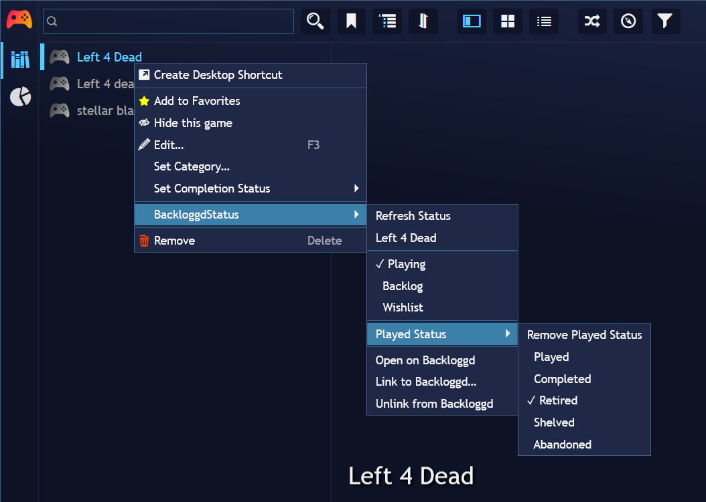
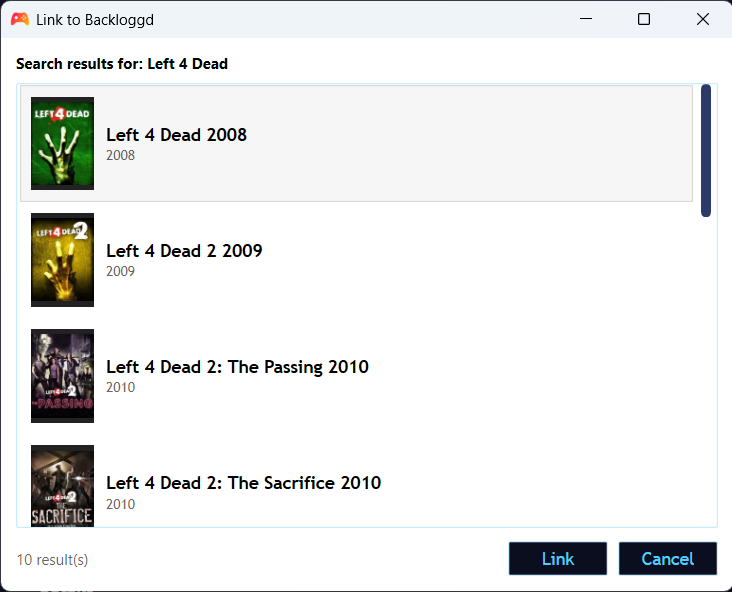
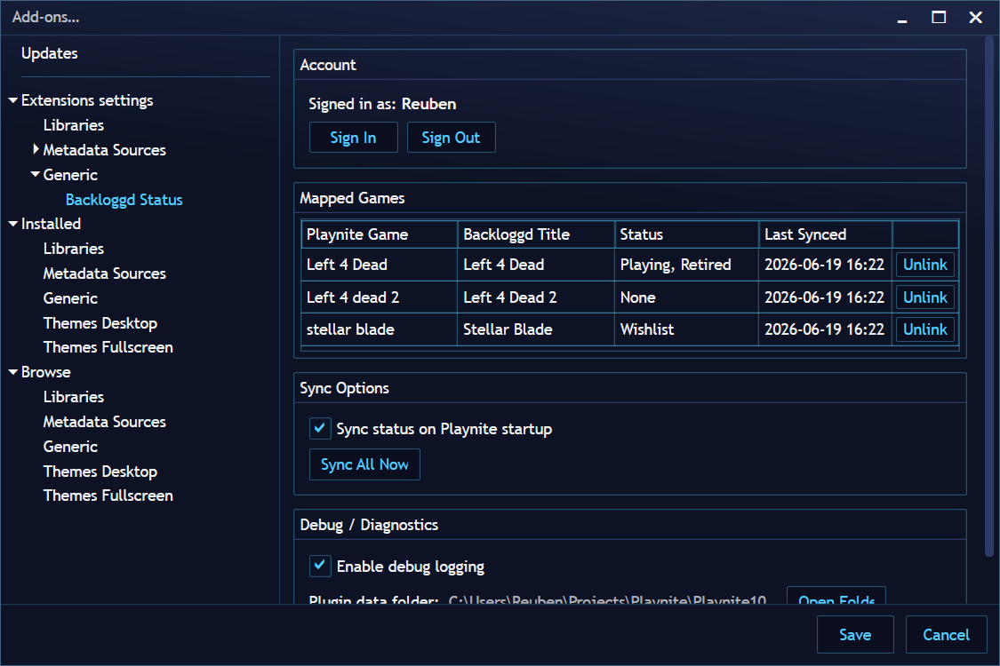

# Backloggd Status

A [Playnite](https://playnite.link/) extension that lets you view and update your [Backloggd](https://backloggd.com/) game statuses directly from within Playnite.

## Screenshots

| Context menu | Search dialog | Settings |
| --- | --- | --- |
|  |  |  |

## Features

- Link any Playnite game to its Backloggd page via a built-in search dialog
- Set or unset **Playing**, **Backlog**, and **Wishlist** statuses from the game context menu
- Set a **Played** sub-status: Played, Completed, Retired, Shelved, or Abandoned
- Remove a Played sub-status
- **Refresh Status** for a single game, or **Sync All** to pull current Backloggd state for your entire library
- Active statuses are marked with ✓ in the context menu
- Optional auto-sync on Playnite startup

## Requirements

- [Playnite](https://playnite.link/) 6.x
- A [Backloggd](https://backloggd.com/) account

## Installation

### From the Playnite Addon Browser (recommended)

1. Open Playnite and go to **Main Menu → Add-ons…**
2. Search for **Backloggd Status** under the Generic section.
3. Click **Install**.

### Manual install

1. Download the `.pext` file from the [Releases](https://github.com/reubensinha/PlayniteBackloggdStatus/releases) page.
2. Drag the file onto the Playnite window, or open it with Playnite, to install.

## Getting Started

### 1. Sign in

Open the extension settings (**Main Menu → Extensions → Backloggd Status**) and click **Sign In**. A browser window will open — log into your Backloggd account and the window will close automatically.

### 2. Link a game to Backloggd

Right-click any game in your library and choose **BackloggdStatus → Link to Backloggd…**. A search dialog will appear with results from Backloggd. Select the correct entry to link it.

### 3. Update status

Right-click a linked game and use the **BackloggdStatus** submenu to set or change its status. Status changes are applied to Backloggd in real time (allow a few seconds for each change).

## Settings

| Setting | Description |
| --- | --- |
| Sign In / Sign Out | Authenticate with your Backloggd account |
| Sync All | Refresh Backloggd status for every linked game |
| Sync on Startup | Automatically sync all games when Playnite opens |
| Mapped Games | List of all linked games with their current status |

## Known Limitations

- Games must be linked to Backloggd manually; there is no automatic title matching.
- Each status update makes a live request to Backloggd and takes approximately 3–6 seconds.

## Development

### Bumping the version

Update these four places in sync when releasing a new version (`X.Y.Z`):

| File | Field | Example value |
| --- | --- | --- |
| [Properties/AssemblyInfo.cs](Properties/AssemblyInfo.cs) | `AssemblyVersion` and `AssemblyFileVersion` | `0.2.2.0` |
| [extension.yaml](extension.yaml) | `Version` | `0.2.2` |
| [manifests/Generic_BackloggdStatus.yaml](manifests/Generic_BackloggdStatus.yaml) | New `Packages` entry (top of list) | see existing entries |

After merging to master:

1. Build Release with MSBuild.
2. Zip the `bin/Release` output as `BackloggdStatus_v_X_Y_Z.pext` and upload it as a GitHub Release tagged `vX.Y.Z`.
3. Update the `PackageUrl` in `Generic_BackloggdStatus.yaml` to match the release URL, then push to master.

## Contributing

Pull requests are welcome. For major changes, please open an issue first to discuss what you would like to change.

## License

[MIT](LICENSE.txt)
